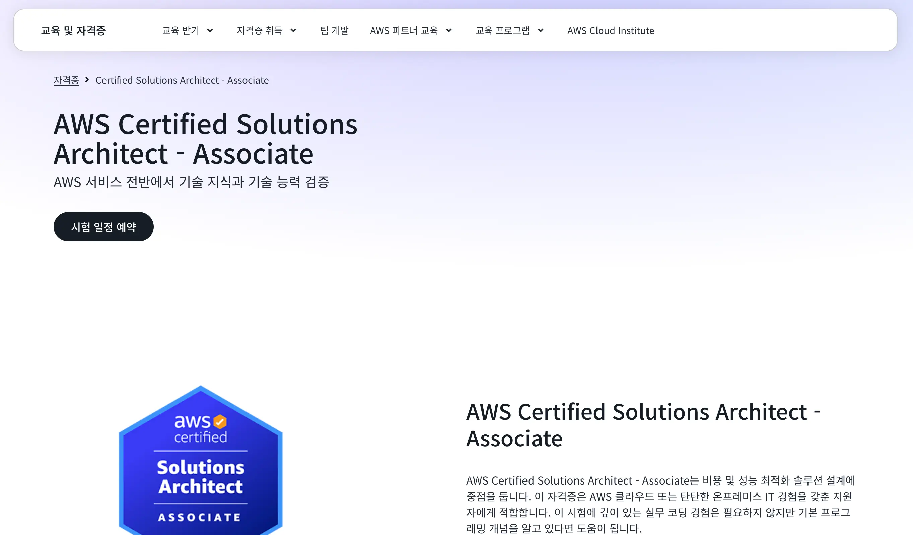
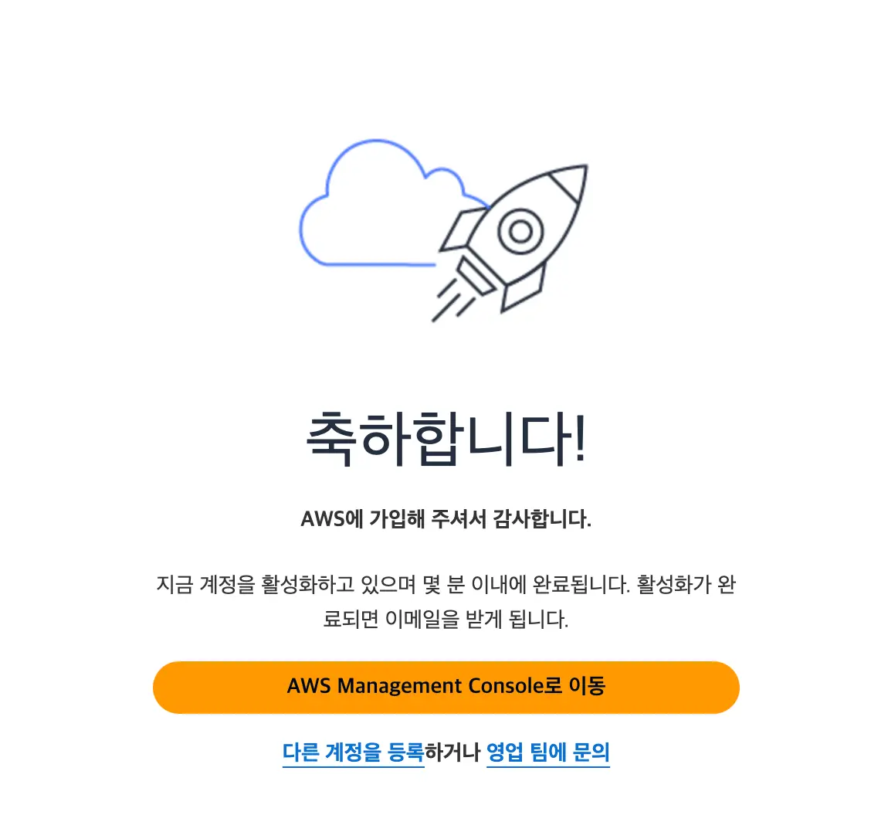
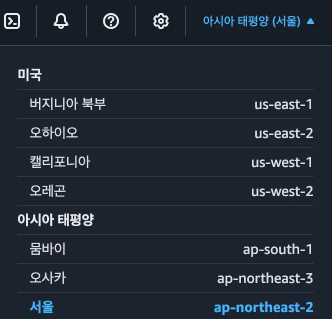
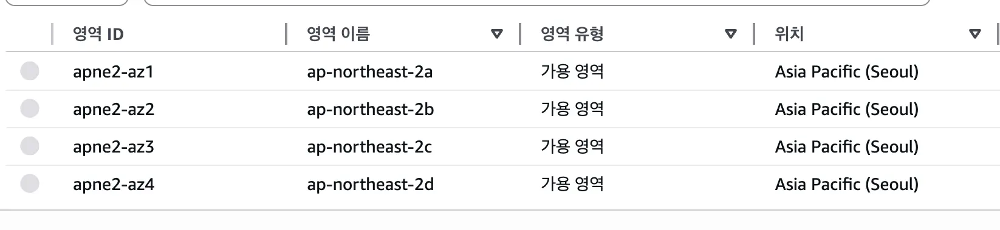
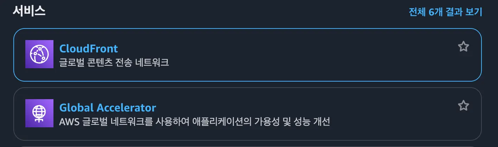
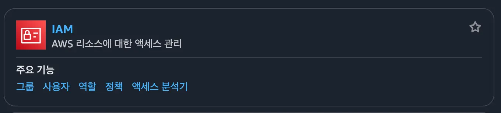

## 소개

AWS SAA (Solutions Architect Associate) 자격증은 AWS 클라우드 플랫폼에서 솔루션 아키텍처를 설계하고 구현하는 능력을 검증하는 자격증입니다.

시험 시간은 130분 안에 총 65문제를 풀어야 하며, 합격 점수는 720점입니다. 시험은 Pearson VUE 테스트 센터 (직접 방문) 또는 온라인 감독 시험 (온라인으로 집에서 응시)으로 응시할 수 있습니다.

## 공부 방법

저는 숭실대학교 중앙 동아리 `SSCC`에서 부원들과 함께 스터디를 진행하며, [해당 강의](https://www.inflearn.com/courses/lecture?courseId=329086)를 수강하여 공부 중입니다.

강의는 총 23섹션 + 1문제풀이로 구성되어 있으며, 각 섹션마다 25분부터 1시간 30분까지 다양하게 구성되어 있습니다.

또한, 100개 이상의 AWS 서비스를 다루고 있기도 하고, 시험 범위가 넓어서 단기간에 집중적으로 공부하는 전략이 좋을 것 같다고 생각합니다.

## AWS 계정 만들기

저는 프리티어를 사용하려고, 무료 계정을 하나 생성했습니다. 

[해당 웹사이트](https://signin.aws.amazon.com/signup?request_type=register)에서 계정을 생성할 수 있습니다.

## AWS 글로벌 인프라

### 리전

AWS는 `리전` 이라는 지리적 위치에 따라 여러 `가용 영역`을 운영하고 있습니다. 1개의 리전에는 최소 2개 이상의 가용 영역이 존재합니다.

리전은 다양한 국가에 위치해 있으며, 대부분의 서비스는 리전을 선택하여 사용합니다. (IAM 서비스 같은 글로벌 서비스는 리전에 종속되지 않습니다.)

재해복구 설계 시에는 여러 리전을 사용하여 시스템을 구축하는 것이 좋습니다. (하나의 리전에 장애가 발생하더라도 다른 리전에서 서비스를 계속 제공할 수 있도록)

### 가용 영역

1개의 리전에는 `2개 이상의 가용 영역`이 존재하며, 보통 3~4개의 가용 영역이 존재합니다.

각 가용 영역은 서로 다른 물리적 위치에 있고, 서로 고속 네트워크로 연결되어 있습니다.

### 엣지 로케이션

엣지 로케이션은 콘텐츠 (이미지, 영상, 등등)을 사용자에게 더 빠르게 전달하기 위해 전 세계에 분산된 데이터 센터입니다.

서버에서 멀리 떨어진 사용자에게 콘텐츠를 전송하는게 아닌, 사용자와 가까운 엣지 로케이션에서 콘텐츠를 제공하여 `지연 시간`을 줄이는 역할을 합니다.

종류로는 `AWS CloudFront (CDN)`, `AWS Global Accelerator` 등이 있습니다.

전세계에 수백 개의 엣지 로케이션이 존재하며, 이는 사용자에게 빠른 콘텐츠 전달을 가능하게 합니다.

## IAM (Identity and Access Management)

IAM은 AWS 계정 및 권한을 관리하는 서비스 입니다. (사용자, 그룹, 역할, 정책 등을 관리)

위에서 언급한 것처럼, IAM은 글로벌 서비스이기 때문에 리전에 종속되지 않습니다.

### 사용자 (User)

사용자는 개인 또는 애플리케이션에 대한 특정 권한을 가지고 있는 AWS 계정 내 자격 증명입니다.

한 사용자는 한 사람에게만 할당되는 것이 일반적이라고 합니다.

`암호`, 또는 `액세스 키`를 사용하여 AWS 리소스에 액세스할 수 있습니다. (콘솔 로그인, API 호출 등)

### 그룹 (Group)

그룹은 여러 사용자를 하나로 묶어서 관리할 수 있는 단위입니다. (사용자의 집합)

### 역할 (Role)

특정 권한을 가지고 있는 AWS 자격 증명. (사용자와 달리, 역할은 특정 사용자에게 할당되지 않고, 필요할 때마다 임시로 할당하여 사용할 수 있음)

AWS Security Token Service (STS)를 사용하여 역할을 임시로 할당할 수 있습니다.

토큰은 일시적이며, 특정 기간 동안만 유효합니다. 따라서, 보안적으로, 유출이나 재사용의 위험이 줄어듭니다.

#### 역할 vs 사용자

1. 사람을 위한 자격 증명 -> `사용자`
2. 임시 권한이 필요한 경우 -> `역할`
3. 임시 권한이 필요하지 않는 경우 -> `사용자`

## EC2

EC2는 AWS 클라우드 컴퓨팅 서비스로, EC2 클라우드 가상 서버를 `인스턴스`라고 부릅니다.

### EC2의 요소

1. 이름, 태그
2. 애플리케이션 및 OS 이미지 (AMI)
3. 인스턴스 유형 (CPU, 메모리, 스토리지 등)
4. 키 페어 (SSH 접속을 위한 키)
5. 네트워크 설정 (VPC, 서브넷, 보안 그룹 등)
6. 스토리지 구성
7. 고급 세부 정보
